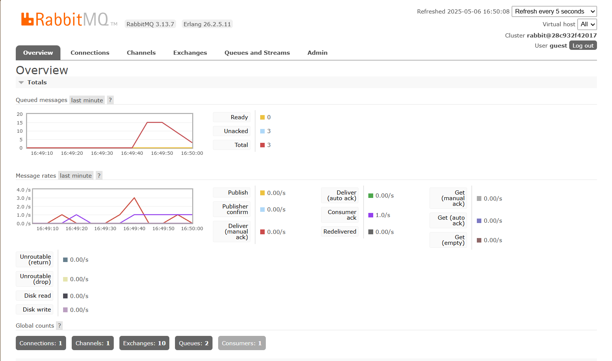
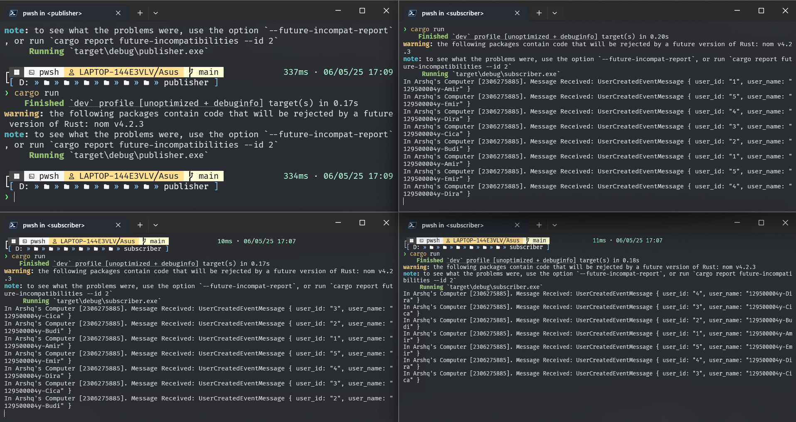
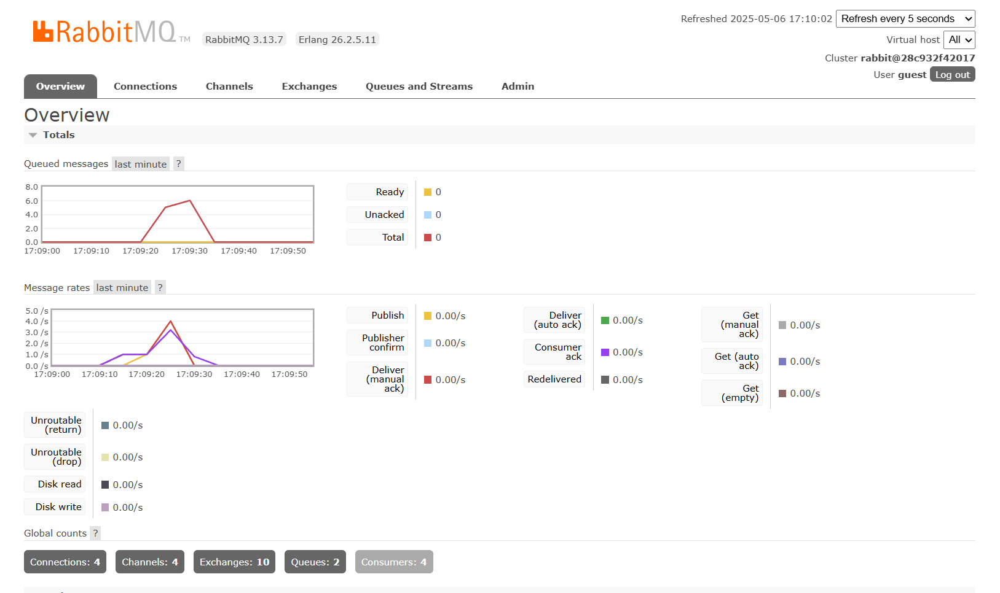

# Tutorial 9 - Software Architecture

## Muhammad Radhiya Arshq - 2306275885

### a. What is amqp?
AMQP singkatan dari Advanced Message Queuing Protocol yang merupakan sebuah protokol komunikasi berbasis pesan yang digunakan untuk mengirim pesan antara sistem terdistribusi. Protokol ini umum digunakan dalam sistem antrian pesan seperti RabbitMQ untuk memastikan komunikasi yang handal dan terpisah antar komponen sistem (misalnya antara producer dan consumer).

### b. What does it mean? guest:guest@localhost:5672 , what is the first guest, and what is the second guest, and what is localhost:5672 is for?
Dari kode yang ditulis sebelumnya snippet kode itu digunakan di fungsi main sebagai URL koneksi ke message broker queue. "guest" pertama merupakan username yang digunakan untuk login ke message broker, "guest" kedua merupakan password dari user guest, dan localhost:5672 merupakan alamat host server sekaligus port default untuk protokol AMQP yang digunakan message broker, dalam kasus ini, RabbitMQ.

### Simulate Slow Subscriber

Jika dilihat dari chart RabbitMQ diatas, Queued messages mencapai hingga 15, Ini terjadi karena saya melakukan perintah cargo run pada publisher sebanyak 4 kali. Karena publisher mengirim data 5 sekaligus dan saya mengirim data sebanyak 4 kali, maka dengan adanya `thread::sleep(ten_millis);` maka akan ada (4-1) * 5 data message yang queued.

### Simulate Many Subscriber

Chart pada RabbitMQ seperti itu karena terjadi burst publish dari publisher dan proses konsumsi dari beberapa subscriber. Publisher dan subscriber aktif pada waktu yang hampir bersamaan, tapi publisher lebih cepat mengirim daripada subscriber bisa memproses. Akibatnya, antrian sempat menumpuk, tapi lalu turun lagi karena subscriber memproses secara bertahap karena ada delay sleep(1000ms).

Beberapa hal yang bisa di improve dari kode publisher dan subscriber adalah menerapkan method get_handler_action untuk menghindari panic dan mengurangi duplikasi kode pada publisher dengan menggunakan loop.